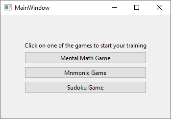
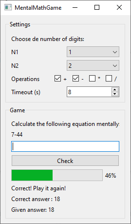
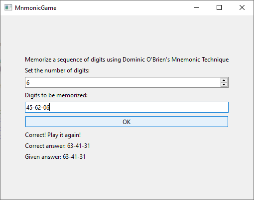
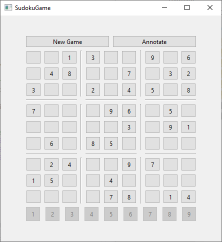

# Project Title: BrainTrainer

## Description:
Brain Trainer is a comprehensive collection of brain training games designed to enhance cognitive abilities while providing an enjoyable gaming experience. Developed using C++ and leveraging the Qt framework for the graphical user interface (GUI), this GitHub project aims to improve mental math skills, mnemonic techniques, and problem-solving abilities through three engaging games: Mental Math, Mnemonic Technique, and Sudoku.

Application developed using The Model View Controller (MVC) architectural design pattern with the Controller being a Singleton class.

The main interface allows the user to choose one of the three games implemented.

## Features:
1. Mental Math
Engage in a challenging mental math game that tests your multiplication skills.

2. Mnemonic
The Mnomnic game askes the user to memorize a sequence of 1-2 digits and type the remembered sequence in the field.

3. Sudoku
Sudoku is a popular game for filling a 9x9 matriz following some rules.

## Key Components:
- C++ Language:
	- The entire project is implemented using C++, a powerful and efficient programming language.

- Qt Framework:
    - The Qt framework is utilized for the development of the graphical user interface (GUI), providing a sleek and user-friendly gaming experience.
    - Leverage Qt's extensive libraries and tools for GUI design and event handling.

- Google Test for C++:
    - Ensure code reliability and robustness through unit testing with Google Test.
    - Write comprehensive test cases to verify the correctness of game logic and functionality.

- Modular Design:
    - Employ a Model View Controller (MVC) architectural design pattern approach, separating the Modules, View and Controller into interconnected elements. 
	- Each game is separeted into independent modules.
    - Easily extend or modify existing games or add new ones in the future.
